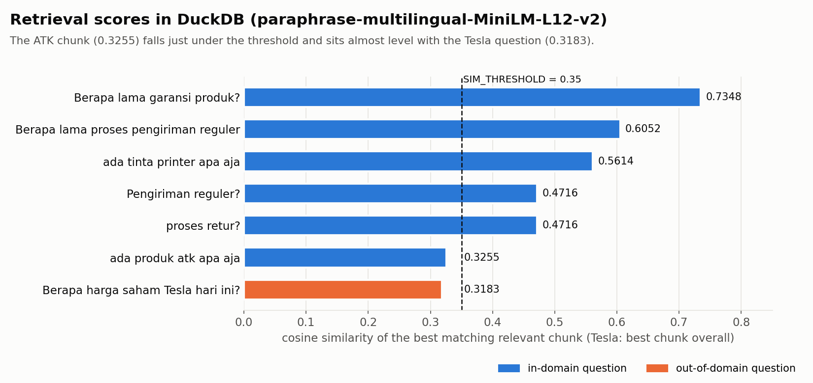

# Knowledge Base RAG di DuckDB

[English](README.md)

Satu notebook untuk menyiapkan knowledge base kecil bagi Retrieval-Augmented Generation (RAG). Teks mentah dan katalog PDF dipotong (chunking), diubah jadi vektor (embedding), lalu disimpan di DuckDB dengan index HNSW. Setelah itu knowledge base diuji lewat semantic search dan LLM lokal berukuran kecil.

Fokusnya ada di sisi ingestion, bagian yang sering salah tanpa terasa: menjalankan ulang sel tidak boleh menggandakan data, parameter chunk harus divalidasi, dan skor similarity harus berada di skala yang bisa diberi threshold.

## Alur

```
Teks FAQ + katalog PDF
        │
        ▼
  chunk_text()  ── chunk berbasis kata dengan overlap, menolak overlap >= size
        │
        ▼
  embed()       ── paraphrase-multilingual-MiniLM-L12-v2, 384 dimensi, dinormalisasi L2
        │
        ▼
  DuckDB        ── id = hash SHA-256 dari isi chunk, INSERT ... ON CONFLICT DO NOTHING
  + vss HNSW    ── metric = cosine
        │
        ▼
  search()      ── array_cosine_distance, skor ditampilkan sebagai similarity (1 - distance)
        │
        ▼
  rag_answer()  ── buang chunk di bawah SIM_THRESHOLD, lalu Qwen2.5-3B-Instruct
                   lewat create_chat_completion (template ChatML), temperature 0.2
```

## Hasil

Semua angka di bawah berasal dari notebook yang sudah dijalankan di repo ini.

### Ingestion

| Pengecekan | Hasil |
|---|---|
| Tiga teks FAQ di-ingest | 3 baris |
| Sel yang sama dijalankan lagi | tetap **3 baris** (duplikat dilewati lewat hash isi) |
| Katalog PDF di-ingest (3 halaman) | 13 chunk baru, total 16 baris |
| `chunk_text(size=5, overlap=15)` | ditolak dengan `ValueError` yang jelas |
| `chunk_text(size=6, overlap=8)` | ditolak dengan `ValueError` yang jelas |

### Retrieval



Skor diambil dari output pencarian di notebook (pertanyaan FAQ dijalankan sebelum katalog ditambahkan, sedangkan pertanyaan ATK, tinta, dan Tesla sesudahnya).

### Jawaban

| Pertanyaan | Konteks yang terambil | Jawaban |
|---|---|---|
| Berapa lama proses pengiriman reguler | 3 chunk di atas threshold (0,58 sampai 0,63) | "Pengiriman reguler memakan waktu 2-4 hari kerja." |
| Berapa harga saham Tesla hari ini? | tidak ada chunk di atas 0,35 | penolakan, **LLM tidak dipanggil** |
| ada produk atk apa aja | hanya chunk FAQ yang tidak berhubungan yang lolos (0,3524) | penolakan |

## Yang saya pelajari

- **ID acak membuat ingestion tidak idempotent.** Kalau primary key memakai `uuid4()`, setiap kali sel ingest dijalankan ulang, chunk yang sama masuk lagi tanpa ada error, dan duplikatnya ikut memakan slot hasil retrieval. Memakai hash isi chunk sebagai ID menyelesaikan ini langsung di level database.
- **Overlap yang lebih besar dari ukuran chunk tidak gagal dengan sendirinya.** Langkah geser jatuh ke satu kata, dan fungsi menghasilkan belasan chunk yang hampir identik. Validasi parameter mengubahnya jadi error yang langsung terlihat.
- **Embedding yang dinormalisasi membuat skor bisa dipakai.** Dengan vektor ternormalisasi dan cosine distance, skor berada di rentang 0 sampai 1, jadi threshold lebih mudah dipahami.
- **Threshold juga bisa membuang jawaban yang benar.** Pertanyaan ATK adalah pertanyaan katalog yang sah, tapi chunk katalog terbaiknya hanya mendapat 0,3255, sedikit di bawah 0,35 dan sangat dekat dengan pertanyaan Tesla (0,3183). Kemungkinan singkatan "atk" kurang terwakili oleh model embedding ini.

## Keterbatasan

- Threshold 0,35 dikalibrasi secara kasar dari segelintir pertanyaan, dan setidaknya memotong satu pertanyaan yang relevan (ATK).
- Knowledge base-nya sangat kecil (3 teks FAQ dan katalog 3 halaman), jadi skornya belum bisa menggambarkan perilaku pada korpus yang lebih besar.
- `llama-cpp-python` di notebook ini diinstal tanpa CUDA, sehingga Qwen2.5-3B berjalan di CPU walaupun `n_gpu_layers=-1` sudah diset.
- Menyimpan index HNSW ke file DuckDB bergantung pada `hnsw_enable_experimental_persistence`, yang oleh DuckDB masih ditandai eksperimental.

## Cara menjalankan

1. Buka `rag_knowledge_base_duckdb.ipynb` di Google Colab.
2. Jalankan sel secara berurutan. Tahap unggah PDF memakai `data/katalog_produk_emerald.pdf` (atau PDF berbasis teks lainnya).
3. Tahap terakhir me-mount Google Drive dan menyimpan `knowledge.duckdb`. Ganti `DRIVE_DIR` dengan folder milikmu.

## Data

- Tiga teks FAQ singkat (garansi, retur, pengiriman) yang ditulis langsung di notebook.
- `data/katalog_produk_emerald.pdf`: katalog produk sintetis untuk perusahaan fiktif, dibuat khusus untuk latihan ini. Produk dan harganya tidak nyata.

## Teknologi

DuckDB + `vss` · sentence-transformers · pypdf · llama-cpp-python · Qwen2.5-3B-Instruct (GGUF, Q4_K_M) · Google Colab

## Lisensi

[MIT](LICENSE)
